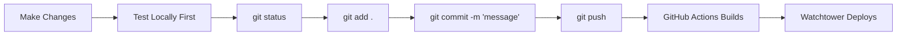

# Git Basics & Team Workflow Guide

A beginner-friendly guide to Git for your Webex bot project.

---

## The Basics: Daily Commands

### 1. Check Status (Do This First!)
```bash
git status
```
Shows what files you've changed. **Always run this before committing.**

### 2. Stage Changes
```bash
git add .                    # Add ALL changes
git add bot.py               # Add specific file
git add *.py                 # Add all Python files
```

### 3. Commit (Save a Checkpoint)
```bash
git commit -m "Short description of what you changed"
```
Good commit messages:
- ✅ `"Add /status command to bot"`
- ✅ `"Fix: Bot not responding to DMs"`
- ❌ `"stuff"` or `"update"`

### 4. Push (Send to GitHub)
```bash
git push
```
This triggers GitHub Actions → builds Docker image → Watchtower deploys.

---

## Safe Workflow (Won't Crash Watchtower)



### Before Pushing, Always:
```bash
# 1. Test your changes locally
python bot.py

# 2. Check what you're committing
git status
git diff        # See exact changes

# 3. Then commit and push
git add .
git commit -m "Your message"
git push
```

---

## Working on Features (Branches)

Branches let you work on features without affecting the main code.

### Create a Branch
```bash
git checkout -b feature/new-command    # Create and switch to branch
```

### Work on Your Branch
```bash
# Make changes, then:
git add .
git commit -m "Add /weather command"
git push -u origin feature/new-command  # First push to new branch
git push                                 # Subsequent pushes
```

### Merge When Ready
```bash
git checkout master                  # Switch back to master
git pull                             # Get latest changes
git merge feature/new-command        # Merge your feature
git push                             # Deploy!
```

### Delete Branch (After Merge)
```bash
git branch -d feature/new-command    # Delete local branch
```

---

## Team Workflow

### Before Starting Work
```bash
git pull    # Always get latest changes first!
```

### If Someone Else Pushed Changes
```bash
git pull                    # Get their changes
# Fix any conflicts if needed
git push                    # Push your changes
```

### Pull Request Workflow (Recommended for Teams)
Instead of pushing directly to `master`:

1. Create a feature branch
2. Push branch to GitHub
3. Open a **Pull Request** on GitHub
4. Team reviews code
5. Merge when approved

---

## Quick Reference

| What You Want | Command |
|---------------|---------|
| See changes | `git status` |
| See exact diffs | `git diff` |
| Save changes | `git add . && git commit -m "message"` |
| Push to GitHub | `git push` |
| Get latest code | `git pull` |
| Create branch | `git checkout -b branch-name` |
| Switch branch | `git checkout branch-name` |
| See all branches | `git branch` |
| Undo uncommitted changes | `git checkout -- filename` |
| Undo last commit (keep files) | `git reset --soft HEAD~1` |

---

## Common Mistakes & Fixes

### "I pushed broken code!"
```bash
# Fix the bug, then:
git add .
git commit -m "Fix: description of fix"
git push
# Watchtower will deploy the fix
```

### "I want to undo my last commit"
```bash
git reset --soft HEAD~1    # Undo commit, keep changes
git reset --hard HEAD~1    # Undo commit AND changes (careful!)
```

### "I have merge conflicts"
1. Open the conflicted files
2. Look for `<<<<<<<` markers
3. Keep the code you want, delete the markers
4. `git add . && git commit -m "Resolve conflicts"`

---

## Your Webex Bot Workflow

```bash
# 1. Get latest code
git pull

# 2. Make your changes to bot.py, ai_client.py, etc.

# 3. Test locally (optional but recommended)
docker build -t ghcr.io/lanceyvang/webex-bot:latest .
docker compose up -d

# 4. Commit and push
git add .
git commit -m "Add new feature XYZ"
git push

# 5. Watch GitHub Actions build
gh run watch

# 6. Watchtower auto-deploys in ~5 minutes
docker logs webex-bot
```

---

## Golden Rules

1. **Always `git pull` before starting work**
2. **Always test before pushing**
3. **Write clear commit messages**
4. **Use branches for big features**
5. **Never commit `.env` files** (already in .gitignore ✅)
